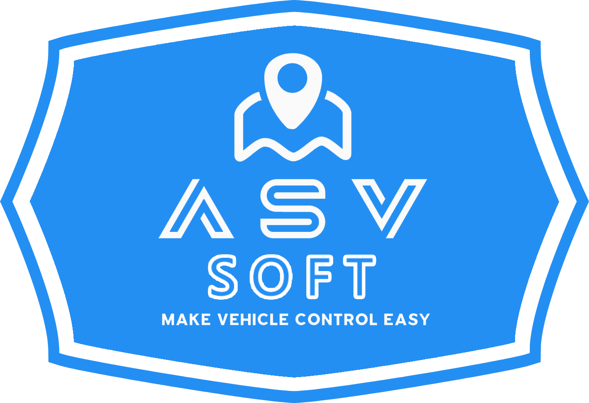
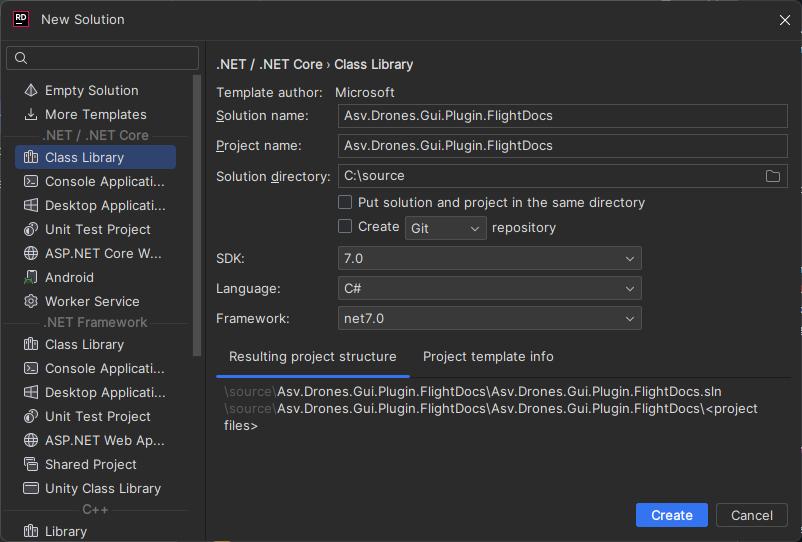
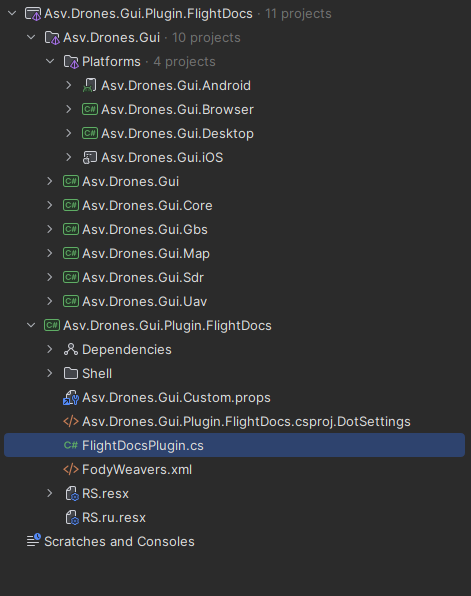
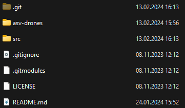
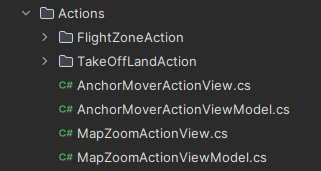
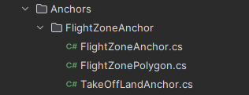
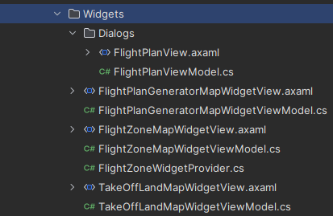

<div align="center">
 
</div>

# **Asv.Drones.Gui.Plugin.FlightDocs**

**Asv.Drones.Gui.Plugin.FlightDocs** stands as a prime example of an open-source plugin implementation for the Asv.Drones.Gui project.

## There is a section in our documentation dedicated to this plugin - [Plugins development](https://docs.asv.me/product-guides/plugins-development)

This illustrative plugin serves as a showcase, offering insights into the intricate art of extending the capabilities of the parent application. Its primary aim is to familiarize users with the fundamental intricacies of crafting their very own plugins and the vast potential they hold.

In this instructive endeavor, you will discover how to empower your interface with action buttons under the "Actions" banner on the map page, create custom widgets and even design custom control elements that align with your unique vision. Furthermore, it delves into the key elements of constructing services and the pivotal role providers play in these service-oriented extensions.

The project's file structure, meticulously crafted to emulate that of the primary `Asv.Drones.Gui` project, is not a mere coincidence. Rather, it is a deliberate choice, as this structured approach proves most advantageous for the development and upkeep of open-source plugins meant to enrich the functionality of the core application.

## How to build

Make sure the next components are installed: 
* .NET SDK 7 - https://dotnet.microsoft.com/en-us/download/dotnet/7.0 
* AvaloniaUI Templates - https://docs.avaloniaui.net/docs/get-started/install
* Avalonia XAML development - https://docs.avaloniaui.net/docs/get-started/set-up-an-editor 

After you installed all of these, you need to follow the steps:

1. Open terminal and clone this repository using `git clone git@github.com:asv-soft/asv-drones-gui-flight-docs.git` command (URL may be different);
2. Open the cloned repository folder using `cd asv-drones-gui-flight-docs`;
3. Execute `git submodule init` command to initialize Asv.Drones.Gui as a submodule;
4. Execute `git submodule update` to set latest version on Asv.Drones.Gui submodule;
5. Then you need to restore NuGet packages in a plugin project with `dotnet restore`, `nuget restore` or through IDE;
6. Finally - try to build your project with `dotnet build` or through IDE. 

## How to use

After building the source code of the plugin project, the final library should be placed in the directory of the already built `Asv.Drones.Gui` application, the next time you launch the application CompositionContainer will see the library and add it to the common list of libraries loaded at startup.

# Plugin development guide

## Introduction

This guide will walk you through the process of developing plugins for the `Asv.Drones.Gui` project. We'll use `Asv.Drones.Gui.Plugin.FlightDocs` as an example as it's a simple project mainly geared towards educational purposes.

## Project Naming

Once you've decided on a project name, follow the plugin naming rule. The main application (`Asv.Drones.Gui`) uses a composition container to load external libraries, which implies that your plugins should be implemented as libraries. Moreover, your library files should follow the naming format `Asv.Drones.Gui.Plugin.**YourPluginName**`. In our case, it will be `Asv.Drones.Gui.Plugin.FlightDocs`. This naming convention is crucial for the composition container to recognize and incorporate your plugin during the program start.



## Project Structure and Dependencies

The structure of your files and folders should mirror that of Asv.Drones.Gui. The final project structure is depicted below.



You can see that `Asv.Drones.Gui` project is present in our plugin solution. You need to add it as a Git submodule into your solution root folder as displayed in the image below.



Next, manually add all the existing projects from `Asv.Drones.Gui`.

Ensure the addition of crucial dependencies such as:

* Resource files (RS.resx) - necessary for text localization.
* App.axaml file - helps in importing and exporting styles and custom controls.
* Asv.Drones.Gui.Custom.props file - used for managing the versions of required NuGet packages.

Below is the structure of `Asv.Drones.Gui.Custom.props` file. Copy this structure as it mentions the versions of all critical NuGet packages.
```xml
<Project>
  <ItemGroup>
    <ProjectReference Condition="'$(ProjectName)' == 'Asv.Drones.Gui'" Include="$(SolutionDir)$(SolutionName)\$(SolutionName).csproj" >
    </ProjectReference>
  </ItemGroup>
  <PropertyGroup>
    <Nullable>enable</Nullable>
    <ProductVersion>0.1.0</ProductVersion>
    <AvaloniaVersion>11.0.5</AvaloniaVersion>
    <AsvCommonVersion>1.13.1</AsvCommonVersion>
    <AsvMavlinkVersion>3.6.0-alpha11</AsvMavlinkVersion>
    <FluentAvaloniaUIVersion>2.0.0</FluentAvaloniaUIVersion>
    <ReactiveUIVersion>19.3.3</ReactiveUIVersion>
    <MaterialIconsAvaloniaVersion>2.0.1</MaterialIconsAvaloniaVersion>
    <ReactiveUIValidationVersion>3.1.7</ReactiveUIValidationVersion>
    <CompositionVersion>7.0.0</CompositionVersion>
    <NLogVersion>5.2.6</NLogVersion>
  </PropertyGroup>
</Project>
```

And you must do the same thing into FlightDocs project file.

```xml
<Project>
  <ItemGroup>
    <ProjectReference Condition="'$(ProjectName)' == 'Asv.Drones.Gui'" Include="$(SolutionDir)Asv.Drones.Gui.Plugin.FlightDocs\Asv.Drones.Gui.Plugin.FlightDocs.csproj" >
      <Private>false</Private>
      <ExcludeAssets>runtime</ExcludeAssets>
    </ProjectReference>
  </ItemGroup>
  <PropertyGroup>
    <Nullable>enable</Nullable>
    <PluginVersion>0.1.0</PluginVersion>
    <AvaloniaVersion>11.0.5</AvaloniaVersion>
    <AsvCommonVersion>1.13.1</AsvCommonVersion>
    <AsvMavlinkVersion>3.6.0-alpha12</AsvMavlinkVersion>
    <FluentAvaloniaUIVersion>2.0.0</FluentAvaloniaUIVersion>
    <ReactiveUIVersion>19.3.3</ReactiveUIVersion>
    <MaterialIconsAvaloniaVersion>2.0.1</MaterialIconsAvaloniaVersion>
    <ReactiveUIValidationVersion>3.1.7</ReactiveUIValidationVersion>
    <CompositionVersion>7.0.0</CompositionVersion>
    <NLogVersion>5.2.6</NLogVersion>
  </PropertyGroup>
</Project>
```

Once we've completed the initial steps, we can proceed further.

Our next task involves creating a class that will act as the entry point for our plugin. If we refer to the code provided earlier, we can see that this class is named "FlightDocsPlugin.cs".

Let's delve into the details of this class!

```csharp
using System.ComponentModel.Composition;
using Asv.Drones.Gui.Core;

namespace Asv.Drones.Gui.Plugin.FlightDocs;

[PluginEntryPoint("FlightDocs", CorePlugin.Name)]
[PartCreationPolicy(CreationPolicy.NonShared)]
public class FlightDocsPlugin : IPluginEntryPoint
{
    [ImportingConstructor]
    public FlightDocsPlugin()
    {
    }
    public void Initialize()
    {
    }

    public void OnFrameworkInitializationCompleted()
    {
    }

    public void OnShutdownRequested()
    {
    }
}
```

The FlightDocsPlugin class implements the IPluginEntryPoint interface and the PluginEntryPoint attribute. This designates the FlightDocsPlugin class as a plugin entry point. The creation policy for the entry point is always shared.

The plugin project has Map folder, which contains several more folders:
* **Actions:** Contains all actions that can be perfomed within plugin.
* **Anchors:** Contains all anchors used to mark points on a map.
* **Widgets:** Includes all widgets and dialogs used by plugin.

This organization mirrors the structure of the Asv.Drones.Gui solution files. Let's explore the contents of these folders:

1. **Actions:**

   

   This folder contains classes that implement several actions that can be perfomed while using this plugin. **FlightZoneAction** allows user to add points that represent the flight zone, **TakeOffLandAction** allows user to specify points where take off and landing will occure, **AnchorMoverAction** allows user to enable anchor editing mode where he can move anchors on map with drag-and-drop and **MapZoomAction** allows user to change map zoom.

2. **Anchors:**

   

   This folder contains classes that implement anchors used in this plugin. **FlightZoneAnchor** is used to display flight zone points, **FlightZonePolygon** is used to draw a poligon that connects all flight zone points and **TakeOffLandAnchor** is used to display take off and land points.

3. **Widgets:**

   

   This folder contains classes and views that implement widgets used in this plugin. **FlightZoneMapWidget** is displayed in the right side of the main screen and is used to change flight zone points location or delete them. **TakeOffLandMapWidget** is used to change take off and land points location or delete them. **FlightPlanGeneratorMapWidget** is used to fill in other flight zone relevant data, such as altitude of flight, date of flight and other information. It is later used to form Flight Plan data that can be used to request flight permission from authorities. **FlightPlanView** is a dialog popup that displays generated Flight Plan data. There is also a **FlightZoneWidgetProvider** class, which we will discuss in the next section of this guide.

## Code Explanation

### Basic Code Structure

The basics of code structure are the same as for any other MVVM application, written using Avalonia UI. You can check out more details about this topic in our [Weather Plugin example] (https://github.com/asv-soft/asv-drones-gui-weather)

### Interaction between plugin and main software

Now lets discuss how plugins can interact with main projects codebase. For example, **FlightZoneWidgetProvider** class is used to create and provide map widget view models for flight zones. It takes in a localization service and configuration as inputs when constructed.

```csharp
using System.ComponentModel.Composition;
using Asv.Cfg;
using Asv.Drones.Gui.Core;
using DynamicData;

namespace Asv.Drones.Gui.Plugin.FlightDocs;

[Export(FlightZoneMapViewModel.UriString, typeof(IViewModelProvider<IMapWidget>))]
[PartCreationPolicy(CreationPolicy.NonShared)]
public class FlightZoneWidgetProvider : ViewModelProviderBase<IMapWidget>
{
    [ImportingConstructor]
    public FlightZoneWidgetProvider(ILocalizationService loc, IConfiguration cfg)
    {
        Source.AddOrUpdate(new FlightZoneMapWidgetViewModel(loc));
        Source.AddOrUpdate(new TakeOffLandMapWidgetViewModel(loc));
        Source.AddOrUpdate(new FlightPlanGeneratorMapWidgetViewModel(loc, cfg));
    }
}
```

The main purpose of this class is to create view model instances for different map widgets related to flight zones and add them to the Source collection. It does this by calling the AddOrUpdate method in the constructor, passing new instances of the **FlightZoneMapWidgetViewModel**, **TakeOffLandMapWidgetViewModel**, and **FlightPlanGeneratorMapWidgetViewModel** classes.
These view model classes are specific to different flight zone related map widgets. The **FlightZoneWidgetProvider** doesn't contain the implementation logic for these view models. It just handles creating them and adding them to the Source collection.
The Source collection property is from the base **ViewModelProviderBase** class, which is a Core class from parent project asv-drones. This contains the view model instances that this provider creates. Other code can then get the appropriate view model from this Source collection for a given map widget type.

So in summary, the **FlightZoneWidgetProvider** class is responsible for creating and providing the view models for flight zone related map widgets. It encapsulates the view model creation logic in one place and exposes the view models through the Source collection for other code to use. This allows separating the view model creation from the consumption.

Another good example is **FlightZoneMapAnchorProvider** class, because it can update it's items dynamically. It is used to provide map anchor data to a flight zone map view model.

```csharp
using System.ComponentModel.Composition;
using Asv.Common;
using Asv.Drones.Gui.Core;
using DynamicData;

namespace Asv.Drones.Gui.Plugin.FlightDocs;

[Export(FlightZoneMapViewModel.UriString, typeof(IViewModelProvider<IMapAnchor>))]
[PartCreationPolicy(CreationPolicy.NonShared)]
public class FlightZoneMapAnchorProvider : ViewModelProviderBase<IMapAnchor>
{
    [ImportingConstructor]
    public FlightZoneMapAnchorProvider()
    {
        
    }

    public void Update(SourceList<IMapAnchor> anchors)
    {
        anchors.Connect()
            .OnItemAdded(_ => Source.AddOrUpdate(_))
            .OnItemRemoved(_ => Source.Remove(_))
            .Subscribe()
            .DisposeItWith(Disposable);
    }
}
```

It takes in a SourceList of IMapAnchor objects as input via the Update method. The IMapAnchor objects contain the data for the anchors to display on the map (e.g. location coordinates, title, etc.).
The Update method subscribes to events on the input SourceList to keep the **FlightZoneMapAnchorProvider's** own Source property in sync. When anchors are added or removed from the input, it adds or removes them from its own Source respectively.
The Source property is used as the output - it contains the latest set of IMapAnchor objects that should be displayed on the map. By syncing it to the input SourceList, it ensures the map view model always has the updated anchor data.

#### The main logic flow is:
##### 1. The Update method is called with a SourceList containing map anchors
##### 2. It subscribes to events on that SourceList
##### 3. When anchors are added/removed from the input, it updates its own Source property accordingly
##### 4. The Source property is used by the map view model to show the anchors

So in summary, the **FlightZoneMapAnchorProvider** acts as a bridge between an input SourceList of anchors and the view model. It propagates changes to the anchors to keep the view model up to date. This allows the view model to always display the latest anchor data.